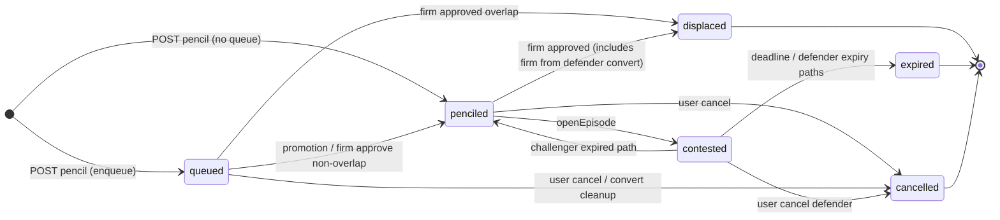
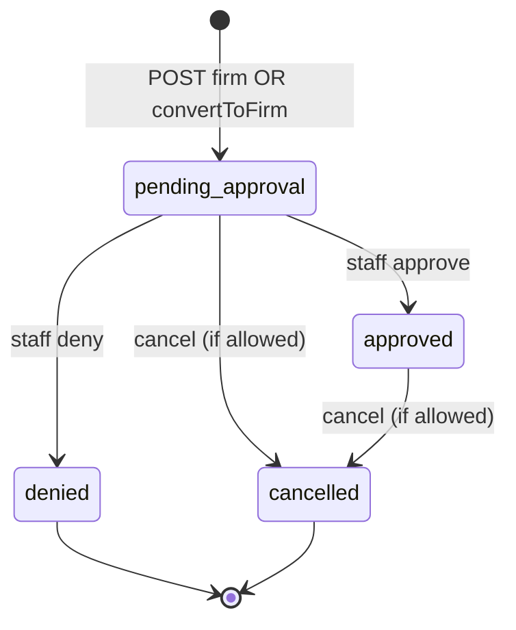
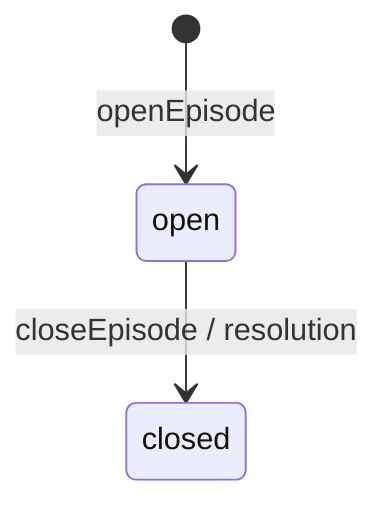

# Booking & contention — transition catalog (first-pass seed)

**Purpose:** Seed for your own **#2 Transition catalog + state machine notes**.

**Staff / admin (non-technical):** See [`booking-system-rules-staff.md`](booking-system-rules-staff.md) for the same rules in plain language.

**Scope:** Inferred from `server/controllers/booking.controller.js`, `server/services/contention.service.js`, `server/jobs/booking-expiry.js`, `server/models/booking.js`, `server/models/contentionepisode.js`, `server/models/contentionqueueitem.js`, `server/utils/booking-rules.js`, plus **post–first-pass fixes** documented in **Section 13** (calendar, dashboard copy, auth, schema/migration, seeders, contention edge cases).

**How to use:** Copy rows into a spreadsheet or extend this file. Add **Rule IDs** and **TC-…** test anchors. Remove or mark **TBD** if you change behavior.

---

## 0) Subsystems (draw separate diagrams)

| Subsystem | Table / entity         | Lifecycle                                                                      |
| --------- | ---------------------- | ------------------------------------------------------------------------------ |
| **A**     | `Bookings` row         | `bookingType` + `status` (+ `expiryAt`, `displacedByBookingId`, thread fields) |
| **B**     | `ContentionEpisodes`   | `open` → `closed`                                                              |
| **C**     | `ContentionQueueItems` | created when queued; destroyed when queue drained or on some expiry paths      |

**Rule:** Do not draw one state machine that mixes **A** and **B** without labeling lanes — episode state is not booking status.

---

## 1) Global enums (Postgres `Bookings.status`)

All values exist on the model; **not every value is reachable for every `bookingType`.**

`penciled` | `contested` | `contesting` | `queued` | `pending_approval` | `approved` | `denied` | `cancelled` | `expired` | `displaced` | `completed`

**Terminals (no further business transitions on that row):**  
`cancelled`, `denied`, `expired`, `displaced`, `completed` — see `TERMINAL_STATUSES` in `server/models/booking.js`.

**Firm scheduling blockers (for pencils):**  
`pending_approval`, `approved` — `FIRM_BLOCKING_STATUSES` in `server/models/booking.js`.

**Active pencils (overlap / contention logic):**  
`penciled`, `contested`, `queued` — `ACTIVE_PENCIL_STATUSES`.

---

## 2) Time / guard primitives (`server/utils/booking-rules.js`)

| Code / concept          | Meaning                                                                                                             |
| ----------------------- | ------------------------------------------------------------------------------------------------------------------- |
| `BOOKING_LOCK_WINDOW`   | Create, **convert-to-firm**, and **firm approve** blocked when `hoursUntilStart(start) <= 24`                       |
| Firm approval cutoff    | Same boundary: staff cannot approve `pending_approval` inside the lock window; cron expires those rows to `expired` |
| Pencil `expiryAt`       | `min(issuedAt + 3d, startTime − 24h)`                                                                               |
| Contention `deadlineAt` | `min(now+24h, start−24h, pencil expiryAt)`; must be `> now` to open episode (`CONTENTION_DEADLINE_INVALID`)         |

---

## 3) `ContentionEpisodes` transitions

| ID    | From   | To       | Trigger                        | Notes                                                                                       |
| ----- | ------ | -------- | ------------------------------ | ------------------------------------------------------------------------------------------- |
| EP-01 | —      | `open`   | `openEpisode`                  | Sets `defenderBookingId`, `challengerBookingId`, `deadlineAt`, `resourceType`, `resourceId` |
| EP-02 | `open` | `closed` | `closeEpisode`                 | After drain or resolution path                                                              |
| EP-03 | `open` | `closed` | `resolveDueContentionEpisodes` | If defender row is **firm** (edge): close only, no `applyChallengerWins`                    |
| EP-04 | `open` | (n/a)    | `resolveDueContentionEpisodes` | Else: `applyChallengerWins` then `promoteQueueAfterChallengerWin`                           |

**Queue drain:** `drainEpisodeQueue` deletes all `ContentionQueueItems` for `episodeId` before closing in most paths.

**Promotion stragglers:** After `openEpisode` inside `openEpisodeOrEnqueueFromWinner` (overlap branch), `attachUnqueuedPencilOverlapsToEpisode` runs so pencils that overlapped only the prior challenger (never had a queue row) can enqueue on the new episode.

---

## 4) `ContentionQueueItems` lifecycle

| ID   | Event                                                 | Trigger                                                                         |
| ---- | ----------------------------------------------------- | ------------------------------------------------------------------------------- |
| Q-01 | **Insert** row (`episodeId`, `bookingId`, `position`) | `enqueueBookingInEpisode`                                                       |
| Q-02 | **Delete all** for episode                            | `drainEpisodeQueue`                                                             |
| Q-03 | **Delete** where `bookingId = b.id`                   | `booking-expiry.js` after `onBookingCancelledMidContention` for expiring pencil |

---

## 5) Pencil `Bookings` — status transitions (Subsystem A, `bookingType === 'pencil'`)

**Legend:** Guards abbreviated; see controller/service for full conditions.

| ID    | From                                | To                                           | Trigger                                                          | Actor      | Main guards / notes                                                                                   | Side effects (high level)                                                                                                                                                                                                                                                                                                                                                                                                                                                                                                                                                                                                                                                                                          |
| ----- | ----------------------------------- | -------------------------------------------- | ---------------------------------------------------------------- | ---------- | ----------------------------------------------------------------------------------------------------- | ------------------------------------------------------------------------------------------------------------------------------------------------------------------------------------------------------------------------------------------------------------------------------------------------------------------------------------------------------------------------------------------------------------------------------------------------------------------------------------------------------------------------------------------------------------------------------------------------------------------------------------------------------------------------------------------------------------------ |
| P-01  | —                                   | `penciled`                                   | `POST /bookings` create pencil, no foreign overlap               | User       | Lock window; no firm blocker; no own pencil overlap                                                   | `expiryAt` set                                                                                                                                                                                                                                                                                                                                                                                                                                                                                                                                                                                                                                                                                                     |
| P-02  | —                                   | `penciled`                                   | Same, but `openEpisode` after create                             | User       | Foreign pencils overlap + `confirmContention`; defender was `penciled`                                | Defender **same row** → `contested` (P-03); challenger gets the `contesting` marker                                                                                                                                                                                                                                                                                                                                                                                                                                                                                                                                                                                                                                |
| P-03  | `penciled`                          | `contested`                                  | `openEpisode`                                                    | System     | Defender must be `penciled`                                                                           | `ContentionEpisodes` EP-01                                                                                                                                                                                                                                                                                                                                                                                                                                                                                                                                                                                                                                                                                         |
| P-04  | —                                   | `queued`                                     | `enqueueBookingInEpisode` after create                           | User       | Overlapping open episode exists                                                                       | Q-01; new row `queued`                                                                                                                                                                                                                                                                                                                                                                                                                                                                                                                                                                                                                                                                                             |
| P-05  | `queued`                            | `penciled`                                   | `openEpisodeOrEnqueueFromWinner`                                 | System     | Winner does not overlap next queue slot                                                               | May call `tryAttachPencilToContention`                                                                                                                                                                                                                                                                                                                                                                                                                                                                                                                                                                                                                                                                             |
| P-05b | `queued`                            | `penciled`                                   | `openEpisodeOrEnqueueFromWinner` (overlap branch)                | System     | Next waitlist row must be `penciled` before `openEpisode`                                             | Same txn: `queued`→`penciled` then pair with winner (fixes `CONTENTION_CHALLENGER_INVALID`)                                                                                                                                                                                                                                                                                                                                                                                                                                                                                                                                                                                                                        |
| P-06  | `queued`                            | `contested`                                  | `openEpisode` via promotion                                      | System     | Winner overlaps next `queued` (after P-05b promotion)                                                 | New EP; pairing depends on path (see P-19 vs cron winner path)                                                                                                                                                                                                                                                                                                                                                                                                                                                                                                                                                                                                                                                     |
| P-07  | `penciled` / `contested` / `queued` | `expired`                                    | `resolveChallengerExpiredDuringContention`                       | Cron       | Challenger pencil `expiryAt <= now` (episode `open`)                                                  | Episode closed + queue drained; challenger → `expired`; defender **`contested`→`penciled`**; then **`openEpisodeOrEnqueueFromWinner(defender, queueIds)`**                                                                                                                                                                                                                                                                                                                                                                                                                                                                                                                                                         |
| P-08  | `contested`                         | `expired`                                    | `resolveDefenderExpiredDuringContention` → `applyChallengerWins` | Cron       | Defender pencil `expiryAt <= now`                                                                     | Defender terminal `expired`; challenger → `penciled` if not terminal                                                                                                                                                                                                                                                                                                                                                                                                                                                                                                                                                                                                                                               |
| P-09  | `penciled`                          | `expired`                                    | `applyChallengerWins` (defender branch)                          | Cron       | `resolveDueContentionEpisodes` past `deadlineAt`                                                      | Defender `expired` remark set                                                                                                                                                                                                                                                                                                                                                                                                                                                                                                                                                                                                                                                                                      |
| P-10  | `penciled` / `contested`            | `penciled` (+ `tryAttachPencilToContention`) | `onDefenderConvertedToFirm`                                      | User       | Defender row **already** saved as **firm** `pending_approval` in txn; episode `open`                  | Episode closed + queue drained; challenger → **`penciled`**, `displacedByBookingId` cleared; **no** `displaced` until **`onFirmBookingApproved`** (**P-15**).                                                                                                                                                                                                                                                                                                                                                                                                                                                                                                                                                      |
| P-11  | `queued`                            | `penciled` (+ `tryAttachPencilToContention`) | `onDefenderConvertedToFirm`                                      | User       | Drained queue IDs from that episode                                                                   | All **`queued`→`penciled`** (phase 1), then per-id **`tryAttach`** (phase 2); overlap with the new firm **does not** displace at convert (**P-16** on approve for overlaps).                                                                                                                                                                                                                                                                                                                                                                                                                                                                                                                                       |
| P-12  | —                                   | —                                            | —                                                                | —          | _Row kept for ID stability; queue split “overlap vs non-overlap at convert” is folded into **P-11**._ |                                                                                                                                                                                                                                                                                                                                                                                                                                                                                                                                                                                                                                                                                                                    |
| P-13  | `*` (active)                        | `cancelled`                                  | `cancelBooking` after `onBookingCancelledMidContention`          | User/Staff | Not already terminal; firm cancel has extra lock rule                                                 | Episode/queue handling; cancelled row saved **before** queue promotion                                                                                                                                                                                                                                                                                                                                                                                                                                                                                                                                                                                                                                             |
| P-14  | `penciled` / `queued`               | `expired`                                    | Cron expiry job                                                  | Cron       | `expiryAt <= now`; status still in `['penciled','queued']`                                            | `onBookingCancelledMidContention` then `expired`                                                                                                                                                                                                                                                                                                                                                                                                                                                                                                                                                                                                                                                                   |
| P-15  | `penciled`                          | `displaced`                                  | `onFirmBookingApproved`                                          | Staff      | Overlaps approved firm window; not already `displaced`                                                | `displacedByBookingId = firm.id`                                                                                                                                                                                                                                                                                                                                                                                                                                                                                                                                                                                                                                                                                   |
| P-16  | `queued`                            | `displaced`                                  | `onFirmBookingApproved`                                          | Staff      | Episode touches firm; queue item overlaps firm                                                        | Same FK                                                                                                                                                                                                                                                                                                                                                                                                                                                                                                                                                                                                                                                                                                            |
| P-17  | `queued`                            | `penciled`                                   | `onFirmBookingApproved`                                          | Staff      | Queue item does **not** overlap firm                                                                  | Then `tryAttachPencilToContention`                                                                                                                                                                                                                                                                                                                                                                                                                                                                                                                                                                                                                                                                                 |
| P-18  | `pencil` row                        | `firm` + `pending_approval`                  | `convertToFirm`                                                  | User       | Not challenger/queued; no firm blocker; **not** inside 24h pre-start lock                             | Same row: `bookingType`, `status`, auth fields, `expiryAt` null — **saved as firm before** `onDefenderConvertedToFirm` when an episode exists                                                                                                                                                                                                                                                                                                                                                                                                                                                                                                                                                                      |
| P-19  | `penciled` / `queued` / `contested` | `penciled` / `contested` / `queued`          | `reopenContentionAfterDefenderCancelled`                         | System     | **Defender** row cancelled mid-episode (`onBookingCancelledMidContention`)                            | Rebuild episode from **former challenger** + pencils overlapping **that slot only**; drained-queue rows that **do not** overlap former challenger → `penciled` + `tryAttachPencilToContention`. **Pairing:** if **≥2** foreign pencils overlap anchor → **defender** = foreign with **earliest `createdAt`** (tie-break `id`), **challenger** = anchor (`openEpisode` then makes defender **`contested`**). If **1** foreign → **earlier `createdAt`** = **defender**, later = challenger. **Waitlist:** only enqueue foreigners that **overlap the new defender**; others stay **`penciled`** (drop spurious `queued`). No `attachUnqueuedPencilOverlapsToEpisode` on this path (avoids challenger-only enqueue). |
| P-20  | `penciled`                          | `penciled`                                   | `openEpisodeOrEnqueueFromWinner`                                 | System     | Winner promoted, **empty** waitlist                                                                   | Calls `tryAttachPencilToContention(winner)` so overlapping pencils not on old queue (e.g. only overlapped prior challenger) still attach                                                                                                                                                                                                                                                                                                                                                                                                                                                                                                                                                                           |
| P-21  | —                                   | —                                            | `promoteQueueAfterChallengerWin`                                 | System     | Challenger wins by deadline                                                                           | Invokes `openEpisodeOrEnqueueFromWinner` even when `queueIds` empty (pairs with P-20)                                                                                                                                                                                                                                                                                                                                                                                                                                                                                                                                                                                                                              |

**Notes:**

- **P-18** is a **bookingType** transition, not only `status`. Represent it clearly in diagrams (e.g. subgraph edge “convert”).
- **`denied` for pencils:** not produced by current `denyBooking` (firm-only). Treat as **unreachable** unless you add a path later.

---

## 6) Firm `Bookings` — status / type transitions (Subsystem A, `bookingType === 'firm'`)

| ID   | From                                 | To                 | Trigger                     | Actor      | Main guards                                                                                        | Side effects                                                                                                                                  |
| ---- | ------------------------------------ | ------------------ | --------------------------- | ---------- | -------------------------------------------------------------------------------------------------- | --------------------------------------------------------------------------------------------------------------------------------------------- |
| F-01 | —                                    | `pending_approval` | `POST /bookings` firm       | User       | No firm blocker; lock window; own-pencil confirm if needed                                         | May overlap foreign pencils (no displacement yet)                                                                                             |
| F-02 | `pencil` / `penciled` or `contested` | `pending_approval` | `convertToFirm`             | User       | Defender-only; auth file; no firm blocker; **not** inside 24h pre-start lock                       | Row saved as **firm** `pending_approval`, then `onDefenderConvertedToFirm` closes episode (challenger/queue **not** displaced until **F-03**) |
| F-03 | `pending_approval`                   | `approved`         | `approveBooking`            | Staff      | Optimistic lock on row; **not** inside 24h pre-start lock (`FIRM_APPROVAL_LOCK_WINDOW`)            | `onFirmBookingApproved`: pencils → `displaced`, episodes/queue cleanup                                                                        |
| F-04 | `pending_approval`                   | `denied`           | `denyBooking`               | Staff      | Firm + pending only                                                                                | Email notify; `onAwaitingFirmEpisodeRejected` if `awaiting_firm`                                                                              |
| F-05 | `pending_approval` / `approved`      | `cancelled`        | `cancelBooking`             | User/Staff | Cancel allowed anytime **before start** (including inside 24h); blocked once start is reached/past | If **approved**: notify displaced users slot may reopen                                                                                       |
| F-06 | `pending_approval`                   | `expired`          | `booking-expiry` cron (15m) | System     | `bookingType=firm`, still pending, `startTime` within lock horizon (`hoursUntilStart <= 24`)       | Email notify; `onAwaitingFirmEpisodeRejected` if `awaiting_firm`                                                                              |

---

## 7) HTTP-only guards (no row transition on success path)

| ID    | Endpoint                  | Condition                                                         | Response                             |
| ----- | ------------------------- | ----------------------------------------------------------------- | ------------------------------------ |
| G-01  | `POST /bookings`          | Start inside lock window                                          | 400 `BOOKING_LOCK_WINDOW`            |
| G-02  | `POST /bookings` pencil   | Firm overlap                                                      | 409 + conflicts                      |
| G-03  | `POST /bookings` pencil   | Own pencil overlap                                                | 409                                  |
| G-04  | `POST /bookings` pencil   | Foreign overlap without `confirmContention`                       | 409 `requiresContentionConfirmation` |
| G-05  | `POST /bookings` firm     | Firm overlap                                                      | 409                                  |
| G-06  | `POST /bookings` firm     | Own pencil overlap without `confirmOverlapOwn`                    | 409 `requiresConfirmation`           |
| G-07  | `PATCH …/approve`         | Not firm pending                                                  | 400                                  |
| G-08  | `PATCH …/deny`            | Not firm pending                                                  | 400                                  |
| G-09  | `PATCH …/convert-to-firm` | Challenger in open episode                                        | 400                                  |
| G-10  | `PATCH …/convert-to-firm` | `queued`                                                          | 400                                  |
| G-10b | `PATCH …/convert-to-firm` | Start inside lock window                                          | 400 `BOOKING_LOCK_WINDOW`            |
| G-11  | `POST /bookings` rebook   | `displaced` + displacing firm still `pending_approval`/`approved` | 400 `DISPLACED_REBOOK_BLOCKED`       |
| G-12  | `PATCH …/approve`         | Start inside lock window (`hoursUntilStart <= 24`)                | 400 `FIRM_APPROVAL_LOCK_WINDOW`      |

---

## 8) API / list: `canRebook` (not a DB status)

Computed in `getAllBookings` / `getBookingById`: `REBOOKABLE_STATUSES` **except** `displaced` is blocked when `displacedByBooking` is a firm still in `pending_approval` or `approved`.

---

## 9) Cron schedule (`server/jobs/booking-expiry.js`)

| Order (same tick) | Function                                   | Purpose                                    |
| ----------------- | ------------------------------------------ | ------------------------------------------ |
| 1                 | `resolveChallengerExpiredDuringContention` | Challenger expiry during episode           |
| 2                 | `resolveDefenderExpiredDuringContention`   | Defender expiry during episode             |
| 3                 | `resolveDueContentionEpisodes`             | Deadline passed → challenger wins path     |
| 4                 | Approved firm → `completed`                | `endTime <= now`                           |
| 5                 | Firm `pending_approval` → `expired`        | Not approved before 24h pre-start cutoff   |
| 6                 | Bulk pencil `expired`                      | `penciled`/`queued` with `expiryAt <= now` |

Separate daily job: expiry **warnings** email (`notifyBookingExpiringSoon`) for pencils in `penciled`/`contested`/`queued`.

---

## 10) Starter Mermaid (split — replace `...` as you refine)

### Pencil status (simplified — omit rare branches first)

### Firm status

### Contention episode

---

## 11) Suggested next steps for you

1. Walk each **ID** above and mark **observed in UI** / **covered by milestone test** / **gap**.
2. Add explicit rows for **race** cases (double approve, cancel during convert) if you care.
3. Align **emails** (`server/utils/booking-notifications.js`) as a column in your master table.

---

## 12) File map (for maintenance)

| Area                                | Primary files                                                                                                                                                                                                             |
| ----------------------------------- | ------------------------------------------------------------------------------------------------------------------------------------------------------------------------------------------------------------------------- |
| HTTP entry                          | `server/controllers/booking.controller.js`                                                                                                                                                                                |
| Contention orchestration            | `server/services/contention.service.js`                                                                                                                                                                                   |
| Scheduled transitions               | `server/jobs/booking-expiry.js`                                                                                                                                                                                           |
| Overlap / blocker queries           | `server/models/booking.js`                                                                                                                                                                                                |
| Pure time math                      | `server/utils/booking-rules.js`                                                                                                                                                                                           |
| Episode + queue schema              | `server/models/contentionepisode.js`, `server/models/contentionqueueitem.js`                                                                                                                                              |
| Contention + displacement migration | `server/migrations/20260417120000-booking-contention-and-displaced.js`                                                                                                                                                    |
| Auth (session vs DB)                | `server/middleware/auth.middleware.js`                                                                                                                                                                                    |
| Calendar / availability             | `client/src/components/BookingCalendar.jsx`, `client/src/components/bookingCalendarUtils.js`                                                                                                                              |
| My Bookings (queued / displaced UX) | `client/src/components/BookingStatusBadge.jsx`, `client/src/components/my-bookings/ActiveBookingCard.jsx`, `client/src/components/my-bookings/PastBookingRow.jsx`, `client/src/components/my-bookings/BookingToolbar.jsx` |
| Demo data                           | `server/seeders/20260405023050-demo-bookings.js`                                                                                                                                                                          |
| Regression tests                    | `milestone_tests/milestone-13-booking-contention-rules.js`                                                                                                                                                                |

---

## 13) Changelog — updates after first-pass seed

Documented for milestone / contention hardening (manual + `milestone-13` coverage). Cross-check with git history on the branch that contains these changes.

### 13.0 Quick index (everything added or corrected after the first seed)

| Area                     | What changed                                                                                                                                                                                                                                                                                                                                                                                                                                                                                                                                                                                                                             |
| ------------------------ | ---------------------------------------------------------------------------------------------------------------------------------------------------------------------------------------------------------------------------------------------------------------------------------------------------------------------------------------------------------------------------------------------------------------------------------------------------------------------------------------------------------------------------------------------------------------------------------------------------------------------------------------- |
| **Catalog rows**         | **P-05b**, **P-19**–**P-21**; **P-10** / **P-11** convert path releases **`penciled`** + **`tryAttach`** (displace only on approve via **P-15**/**P-16**); **EP** note on promotion stragglers (`attachUnqueuedPencilOverlapsToEpisode`); **F-06** firm **`pending_approval` → `expired`** at approval cutoff; **G-10b**, **G-12**.                                                                                                                                                                                                                                                                                                      |
| **Contention service**   | `queued`→`penciled` before `openEpisode` on promotion overlap; empty-queue **`tryAttachPencilToContention(winner)`**; **`promoteQueueAfterChallengerWin`** when `winnerId` set (empty `queueIds` still calls **`openEpisodeOrEnqueueFromWinner`**); **`attachUnqueuedPencilOverlapsToEpisode`** after overlap `openEpisode` (not on **`reopenContentionAfterDefenderCancelled`**); defender-cancel **P-19** pairing (**`createdAt`** / `id` tie-break; waitlist only if overlaps new defender); **`onDefenderConvertedToFirm`**: close episode, **`penciled`** + **`tryAttach`** (no **`displaced`** until **`onFirmBookingApproved`**). |
| **Booking controller**   | **`GET /bookings/availability`**: optional **`contentionChallenger`** per row (open episode challenger).                                                                                                                                                                                                                                                                                                                                                                                                                                                                                                                                 |
| **Swagger**              | `AvailabilityBooking.contentionChallenger` documented in `server/docs/swagger.json`; challenger plan metadata now includes `episodeId`, `episodeStatus`, `deadlineAt`.                                                                                                                                                                                                                                                                                                                                                                                                                                                                   |
| **Auth middleware**      | Post-JWT **`User.findByPk`** → **401** `AUTH_USER_MISSING` if user row missing.                                                                                                                                                                                                                                                                                                                                                                                                                                                                                                                                                          |
| **Client calendar**      | Event titles **`#<id>`**; **`contesting`** styling from API flag; legend **Defender (`contested`)** / **Challenger (`contesting`)**.                                                                                                                                                                                                                                                                                                                                                                                                                                                                                                     |
| **Demo seeder**          | **`20260405023050-demo-bookings.js`**: satisfy **`bookingThreadId` NOT NULL** via insert-then-`UPDATE bookingThreadId = id`.                                                                                                                                                                                                                                                                                                                                                                                                                                                                                                             |
| **Regression tests**     | **`milestone_tests/milestone-13-booking-contention-rules.js`** (+ **`npm run test:milestone-13`**).                                                                                                                                                                                                                                                                                                                                                                                                                                                                                                                                      |
| **Package scripts**      | Root **`package.json`**: **`test:milestone-13`**, **`test:all`** includes milestone 13.                                                                                                                                                                                                                                                                                                                                                                                                                                                                                                                                                  |
| **Database**             | **`server/migrations/20260417120000-booking-contention-and-displaced.js`**: `queued` / `displaced` on `Bookings`, `displacedByBookingId`, `ContentionEpisodes`, `ContentionQueueItems`, indexes (see migration for full DDL).                                                                                                                                                                                                                                                                                                                                                                                                            |
| **My Bookings / badges** | **`BookingStatusBadge`**: `queued` / `displaced`; **`ActiveBookingCard`**: defender/queued/challenger cards use collapsed **View details** panels; challenger top alert now carries instruction + overlap waterfall + deadline, and challenger convert action is disabled; **`PastBookingRow`**: displaced terminal + rebook messaging; **`BookingToolbar`**: status filters include `queued` / `displaced`.                                                                                                                                                                                                                             |

### 13.1 Contention service (`server/services/contention.service.js`)

| Change                                               | Behavior                                                                                                                                                                                                                                                                                                                        |
| ---------------------------------------------------- | ------------------------------------------------------------------------------------------------------------------------------------------------------------------------------------------------------------------------------------------------------------------------------------------------------------------------------- |
| **Waitlist promotion before `openEpisode`**          | In `openEpisodeOrEnqueueFromWinner`, overlap branch: next row `queued`→`penciled` in same txn before `openEpisode` (challenger must be `penciled`).                                                                                                                                                                             |
| **Empty queue after promotion**                      | If waitlist is empty after a win/promotion, still run `tryAttachPencilToContention(winner)` so other pencils on the resource can attach (e.g. only overlapped removed defender, not old queue).                                                                                                                                 |
| **`promoteQueueAfterChallengerWin`**                 | Runs `openEpisodeOrEnqueueFromWinner` when `winnerId` exists even if `queueIds` is empty (uses empty-queue tryAttach above).                                                                                                                                                                                                    |
| **`attachUnqueuedPencilOverlapsToEpisode`**          | After opening a new episode from `openEpisodeOrEnqueueFromWinner`, attaches `penciled` pencils overlapping defender **or** challenger so “stragglers” get a queue row.                                                                                                                                                          |
| **`findOpenEpisodeOverlappingSlot`**                 | Treats the proposed slot as belonging to an existing `open` / `awaiting_firm` episode if it overlaps **any queued booking** on that episode (not only defender/challenger). Prevents `openEpisode` with a **`queued`** “defender” (`CONTENTION_DEFENDER_INVALID`).                                                              |
| **`onFirmBookingApproved` (orphan defender status)** | If an episode is closed because the **challenger** (or queue) **touches** the approved firm but the **defender’s** window does **not** overlap the firm, the defender was never in the displacement loop and could stay **`contested`** with no open episode; normalized to **`penciled`** + **`tryAttachPencilToContention`**. |
| **`reopenContentionAfterDefenderCancelled`**         | Replaces “former challenger becomes defender + queue head becomes challenger” for **defender cancel**. Cluster = former challenger **slot overlap** only; non-overlapping drained-queue IDs → `penciled` + `tryAttach`. Pairing rules in **P-19**.                                                                              |
| **`onDefenderConvertedToFirm`**                      | Runs **after** defender row is saved **`firm`** + **`pending_approval`**. Closes episode; challenger + drained queue → **`penciled`**, `tryAttach` (two-phase for queue). **`displaced`** only when staff approves (**`onFirmBookingApproved`**), same as **`POST` firm** over foreign pencils.                                 |
| **`onAwaitingFirmEpisodeRejected`**                  | Unfreezes **`awaiting_firm`** when the defender firm row becomes **`denied`** or **`expired`** (same episode cleanup path).                                                                                                                                                                                                     |

### 13.2 HTTP / auth / API

| Change                                                              | Behavior                                                                                                                                                                                                                                                                                            |
| ------------------------------------------------------------------- | --------------------------------------------------------------------------------------------------------------------------------------------------------------------------------------------------------------------------------------------------------------------------------------------------- |
| **`GET /bookings/availability`**                                    | Each row may include **`contentionChallenger: boolean`**: `true` when the booking is `challengerBookingId` on an **open** `ContentionEpisode` for that resource (DB status stays `penciled`). Used for challenger calendar color. Documented in `server/docs/swagger.json` (`AvailabilityBooking`). |
| **`GET /bookings` / `GET /bookings/:id` challenger detail payload** | When `contentionChallenger` is true, `challengerContentionPlan` now includes episode metadata (`episodeId`, `episodeStatus`, `deadlineAt`) in addition to `currentDefenderBookingId` and `steps`, enabling challenger deadline/ETA UX in My Bookings.                                               |
| **`authenticateToken`**                                             | After JWT verify, **`User.findByPk`**; if missing → **401** with `code: AUTH_USER_MISSING` and message to sign in again (e.g. after demo reset / re-seed). Prevents FK error on `Bookings.userId`.                                                                                                  |

### 13.3 Client UI (calendar + My Bookings)

| Change                | Behavior                                                                                                                                                                                                                                                                                                                                                                                                                                  |
| --------------------- | ----------------------------------------------------------------------------------------------------------------------------------------------------------------------------------------------------------------------------------------------------------------------------------------------------------------------------------------------------------------------------------------------------------------------------------------- |
| Calendar: event title | `#<id> <time> [<resource>]` for debugging.                                                                                                                                                                                                                                                                                                                                                                                                |
| Calendar: colors      | Distinct **`contesting`** (challenger) style when `contentionChallenger` is true; legend labels **Defender (`contested`)** vs **Challenger (`contesting`)**.                                                                                                                                                                                                                                                                              |
| Calendar: tooltip     | `formatBookingHoverDetail` shows challenger context (`contesting` marker) when flag set.                                                                                                                                                                                                                                                                                                                                                  |
| My Bookings           | Queued and displaced statuses surfaced in badges, active-card copy, past-row messaging (`canRebook` / firm still pending), and toolbar filters (see **Section 12** file map). Defender/queued/challenger info blocks now default to collapsed **View details**. Challenger cards use a single top alert for instruction + context (active step, overlap waterfall, deadline/ETA) and remove duplicate challenger notice in convert panel. |

### 13.4 Seeders / ops

| Change                                | Behavior                                                                                                                          |
| ------------------------------------- | --------------------------------------------------------------------------------------------------------------------------------- |
| **`20260405023050-demo-bookings.js`** | Inserts `Bookings` with **`bookingThreadId` NOT NULL**: per-row `INSERT … RETURNING id` then `UPDATE … SET bookingThreadId = id`. |

### 13.5 Tests

| Artifact                                                       | Role                                                                                                                                         |
| -------------------------------------------------------------- | -------------------------------------------------------------------------------------------------------------------------------------------- |
| **`milestone_tests/milestone-13-booking-contention-rules.js`** | Contention gates, third pencil queued, **defender cancel** promotion (P-19 / pairing), firm-over-pencil, 24h lock. Updated as rules evolved. |

### 13.6 Catalog rows superseded

- **P-10 / P-11** (first seed): convert-to-firm once described **`cancelled`**; later **`displaced` at convert**; current policy is **`penciled`** + **`tryAttach`** at convert and **`displaced` on staff approve** only (aligned with **`POST` firm**).
- **Defender-cancel** promotion is **not** fully described by **P-05 / P-06** alone; see **P-19** and **Section 13.1**.
