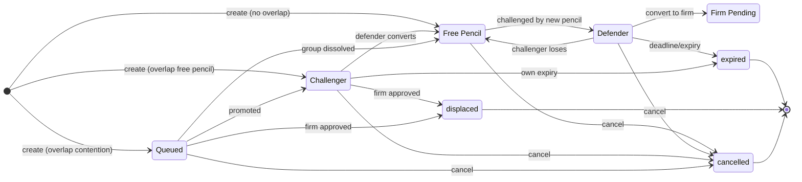
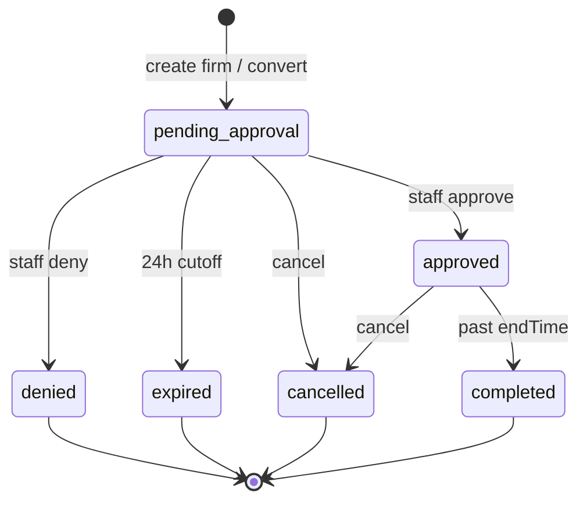

# Booking & Contention — Transition Catalog v2

**Purpose:** Technical reference for the simplified pencil contention system.

**Staff / admin (non-technical):** See [`booking-system-rules-staff.md`](booking-system-rules-staff.md) for the same rules in plain language.

**Architecture Change:** This version removes the separate `ContentionEpisodes` and `ContentionQueueItems` tables. Contention state is now tracked directly on the `Bookings` table via new columns.

---

## 0) Architecture Overview

### Simplified Model

| Component | Description |
| --------- | ----------- |
| `Bookings.contentionGroupId` | Links bookings in the same contention group (uses defender's booking ID) |
| `Bookings.contentionRole` | `'defender'` \| `'challenger'` \| `'queued'` \| `null` (free pencil) |
| `Bookings.contentionDeadlineAt` | Timer deadline for defender to convert to firm |
| `Bookings.challengingBookingId` | FK to the booking being challenged (for challengers) |
| `Bookings.queuePosition` | Order in queue (1, 2, 3...) for queued bookings |

### Key Terminology

| Term | Meaning |
| ---- | ------- |
| **Defender** | The booking being challenged (has the deadline timer) |
| **Challenger** | The booking doing the challenging |
| **Queued** | Booking waiting in line to become challenger |
| **Free Pencil** | Pencil with `contentionRole = null` |
| **Contention Group** | Set of bookings linked by `contentionGroupId` |

---

## 1) Status Enum (Postgres `Bookings.status`)

```
penciled | pending_approval | approved | denied | cancelled | expired | displaced | completed
```

**Note:** `contested` and `queued` are DEPRECATED status values kept for backward compatibility. New code uses:
- **Defender** = `status='penciled'` + `contentionRole='defender'`
- **Queued** = `status='penciled'` + `contentionRole='queued'`

**Terminal statuses (no further transitions):**
`cancelled`, `denied`, `expired`, `displaced`, `completed`

**Firm scheduling blockers:**
`pending_approval`, `approved`

**Active pencils:**
`penciled` (regardless of `contentionRole`)

---

## 2) Time / Guard Primitives (`server/utils/booking-rules.js`)

| Concept | Rule |
| ------- | ---- |
| **24h Lock Window** | Create, convert-to-firm, and firm approve blocked when `hoursUntilStart(start) <= 24` |
| **Pencil Expiry** | `min(issuedAt + 3 days, startTime − 24h)` |
| **Contention Deadline** | `min(now + 24h, startTime − 24h, pencilExpiryAt)`; must be `> now` to start contention |

---

## 3) Core Algorithms

### 3.1 Create Pencil Booking

```
1. Check for firm blockers → reject if any
2. Check for own pencil overlap → reject if any
3. Find foreign pencil overlaps (other users' active pencils)

4. If no foreign overlaps:
   → status=penciled, contentionRole=null (free pencil)

5. If foreign overlaps exist:
   a. Check if ANY overlap is in active contention (has contentionRole != null)
   
   b. If yes (overlap is in contention):
      → Join that contention group as QUEUED
      → contentionRole='queued', queuePosition=next in line
   
   c. If no (all overlaps are free pencils):
      → Start NEW contention
      → Defender = earliest createdAt among overlaps
      → This booking = challenger
      → Set defender.contentionRole='defender', defender.contentionDeadlineAt=computed
      → This booking: contentionRole='challenger', challengingBookingId=defender.id
      → Create contentionGroupId for both (use defender.id as group ID)
```

### 3.2 Defender Loses (Deadline/Cancel/Expire)

```
1. Mark defender as terminal (expired/displaced/cancelled)
2. Clear defender's contention fields
3. Get challenger booking

4. Clear contention state from challenger
5. Run tryAttachPencilToContention(challenger) to check for new overlaps

6. For each queued booking:
   → Clear contention state
   → Run tryAttachPencilToContention to reform groups
```

### 3.3 Challenger Loses (Cancel/Expire)

```
1. Clear challenger's contention fields
2. Get next queued booking (if any)

3. If queue is empty:
   → Clear defender's contention state
   → Run tryAttachPencilToContention(defender)

4. If queue has members:
   → Promote queue[0] to challenger if it overlaps defender
   → Update queue positions for remaining items
   → If no overlap, release defender and rebuild groups
```

### 3.4 Defender Converts to Firm

```
1. Defender row changes: bookingType='firm', status='pending_approval'
2. Clear challenger's contention state (becomes free pencil)
3. Queue stays in group but frozen

4. On firm APPROVED:
   → Displace all pencils that overlap the approved firm
   → Clear contention state from displaced bookings
   → Rebuild groups for remaining pencils

5. On firm DENIED/CANCELLED/EXPIRED:
   → Clear contention state from all group members
   → Run tryAttachPencilToContention for each to rebuild groups
```

---

## 4) Pencil Booking Transitions

| ID | From | To | Trigger | Notes |
| -- | ---- | -- | ------- | ----- |
| P-01 | — | `penciled` (free) | Create pencil, no overlap | `expiryAt` set |
| P-02 | — | `penciled` + `challenger` | Create pencil, overlap free pencil | Starts contention; overlap becomes defender |
| P-03 | — | `penciled` + `queued` | Create pencil, overlap contention | Joins existing group queue |
| P-04 | `free` | `defender` | Another pencil challenges | `contentionDeadlineAt` set |
| P-05 | `defender` | `penciled` (free) | Challenger cancels/expires | Cleared if no more overlaps |
| P-06 | `defender` | `expired` | Deadline passes | Terminal state |
| P-07 | `defender` | `firm pending` | Convert to firm | `bookingType` changes |
| P-08 | `challenger` | `penciled` (free) | Defender converts to firm | Group frozen |
| P-09 | `challenger` | `displaced` | Firm approved | Overlaps approved firm |
| P-10 | `queued` | `challenger` | Promoted from queue | Previous challenger left |
| P-11 | `queued` | `penciled` (free) | Group dissolved | No longer overlaps anyone |
| P-12 | `queued` | `displaced` | Firm approved | Overlaps approved firm |
| P-13 | `*` (active) | `cancelled` | User/staff cancel | Triggers rebuild |
| P-14 | `*` (free) | `expired` | `expiryAt` passes | For non-contention pencils |

---

## 5) Firm Booking Transitions

| ID | From | To | Trigger | Notes |
| -- | ---- | -- | ------- | ----- |
| F-01 | — | `pending_approval` | Create firm | May overlap pencils |
| F-02 | `pencil defender` | `pending_approval` | Convert to firm | Group frozen |
| F-03 | `pending_approval` | `approved` | Staff approve | Displaces overlapping pencils |
| F-04 | `pending_approval` | `denied` | Staff deny | Unfreezes any frozen group |
| F-05 | `pending_approval`/`approved` | `cancelled` | Cancel | Unfreezes group if was frozen |
| F-06 | `pending_approval` | `expired` | 24h cutoff | Not approved before deadline |
| F-07 | `approved` | `completed` | End time passes | Past bookings |

---

## 6) HTTP Guards

| ID | Endpoint | Condition | Response |
| -- | -------- | --------- | -------- |
| G-01 | `POST /bookings` | Start inside lock window | 400 `BOOKING_LOCK_WINDOW` |
| G-02 | `POST /bookings` pencil | Firm overlap | 409 + conflicts |
| G-03 | `POST /bookings` pencil | Own pencil overlap | 409 |
| G-04 | `POST /bookings` pencil | Foreign overlap without `confirmContention` | 409 `requiresContentionConfirmation` |
| G-05 | `PATCH …/convert-to-firm` | Is challenger | 400 |
| G-06 | `PATCH …/convert-to-firm` | Is queued | 400 |
| G-07 | `PATCH …/convert-to-firm` | Inside lock window | 400 `BOOKING_LOCK_WINDOW` |
| G-08 | `PATCH …/approve` | Not firm pending | 400 |
| G-09 | `PATCH …/approve` | Inside lock window | 400 `FIRM_APPROVAL_LOCK_WINDOW` |

---

## 7) Cron Jobs (`server/jobs/booking-expiry.js`)

| Order | Function | Purpose |
| ----- | -------- | ------- |
| 1 | `resolveDueContentionDeadlines` | Defender loses by timeout |
| 2 | `resolveExpiredChallengers` | Challenger pencil expiry |
| 3 | `resolveExpiredDefenders` | Defender pencil expiry |
| 4 | Approved firm → `completed` | Past `endTime` |
| 5 | Firm `pending_approval` → `expired` | 24h cutoff |
| 6 | Free pencils → `expired` | `expiryAt` passed |

Daily: expiry warnings for pencils approaching `expiryAt`.

---

## 8) State Machine Diagrams

### Pencil Contention State



### Firm Status



---

## 9) File Map

| Area | Files |
| ---- | ----- |
| HTTP entry | `server/controllers/booking.controller.js` |
| Contention logic | `server/services/contention.service.js` |
| Scheduled jobs | `server/jobs/booking-expiry.js` |
| Booking model | `server/models/booking.js` |
| Time utilities | `server/utils/booking-rules.js` |
| Notifications | `server/utils/booking-notifications.js` |
| Migration | `server/migrations/20260423120000-contention-overhaul.js` |

---

## 10) API Response Changes

### Booking Object

New fields on booking responses:

```json
{
  "contentionGroupId": 123,
  "contentionRole": "defender",
  "contentionDeadlineAt": "2026-04-25T10:00:00Z",
  "challengingBookingId": null,
  "queuePosition": null,
  "contentionChallenger": false,
  "contentionDetail": {
    "groupId": 123,
    "role": "defender",
    "deadlineAt": "2026-04-25T10:00:00Z",
    "defender": { "bookingId": 123, "..." },
    "challenger": { "bookingId": 456, "..." },
    "queue": [],
    "queueLength": 0
  }
}
```

### Availability Response

Each booking includes:
- `contentionRole`: Role in group or `null`
- `contentionGroupId`: Group ID or `null`
- `contentionChallenger`: `true` when this is the active challenger

---

## 11) Migration Notes

The migration (`20260423120000-contention-overhaul.js`):

1. Adds new columns to `Bookings`
2. Migrates data from `ContentionEpisodes` and `ContentionQueueItems`
3. Converts old `contested` status → `penciled` + `contentionRole='defender'`
4. Converts old `queued` status → `penciled` + `contentionRole='queued'`
5. Drops `ContentionEpisodes` and `ContentionQueueItems` tables

**Backward compatibility:** The `contested` and `queued` status values remain in the enum but are no longer set by new code.

---

## 12) Testing Checklist

### Basic Flows
- [ ] Create free pencil (no overlaps)
- [ ] Create pencil that challenges another (becomes challenger)
- [ ] Create pencil that joins queue
- [ ] Defender converts to firm → challenger released
- [ ] Defender deadline passes → challenger wins
- [ ] Challenger cancels → defender released

### Edge Cases
- [ ] Third pencil joins while contention active
- [ ] Queue promotion when challenger leaves
- [ ] Firm approved displaces multiple pencils
- [ ] Firm denied unfreezes group
- [ ] Pencil expiry during contention
